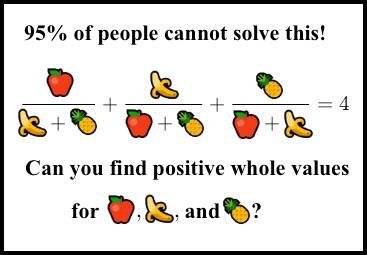

Apple, Banana, Pineapple
========================

This hilarious puzzle was making the rounds in 2024:



There's a [good writeup by Alon Amit](https://www.quora.com/How-do-you-find-the-positive-integer-solutions-to-frac-x-y+z-+-frac-y-z+x-+-frac-z-x+y-4/answer/Alon-Amit)
that starts by linking to [the mathoverflow post](https://mathoverflow.net/questions/227713/estimating-the-size-of-solutions-of-a-diophantine-equation/) where the
puzzle was first posed.

I wanted to see if this could be solved in a few hours by a SAT solver. I wasn't successful, but only because kissat ran out of
memory on my laptop after thinking for a few hours. I may try re-running this some day, it would be nice to show that this
equation is simply solvable by a program without resorting to elliptic curves:

```
$ uv run python examples/apple-banana-pineapple/apple-banana-pineapple.py /tmp/cnf /tmp/extractor.py
$ kissat /tmp/cnf > /tmp/solved
$ python3 /tmp/extractor.py /tmp/cnf /tmp/solved
```
