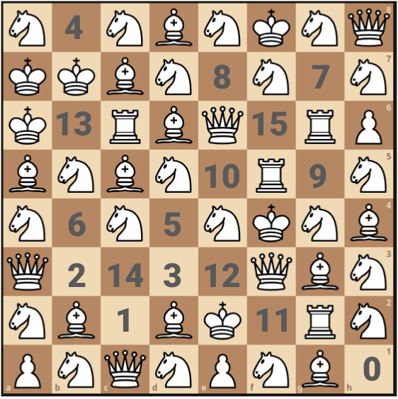

Attacking Chessboard
====================

[This puzzling stackexchange post](https://puzzling.stackexchange.com/q/125896/84078) asks for a configuration
of chess pieces on an standard 8-by-8 board with at least 1 empty square attacked by 1 piece, at least 1 empty
square attacked by 2 pieces, and so on. The solutions have some variants of this problem.

The script in this directory generates chessboards with 1 empty square attacked by 0 pieces, 1 empty square
attacked by 1 piece, etc. It's possible to go up to 15 but 16 is impossible. I've also added a `--unique` flag
that places exactly one square attacked by 0 pieces, exactly one square attacked by 1 piece, etc.

Example:

```
$ poetry run python3 examples/attacking-chessboard/attacking-chessboard.py --uniuqe 15 /tmp/out.cnf /tmp/extractor.py
$ kissat /tmp/out.cnf > /tmp/kissat.out
$ python3 /tmp/extractor.py /tmp.out.cnf /tmp/kissat.out
Solution:
N E N B N K N Q
K K B N E N E N
K E R B Q E R P
B N B N E R E N
N E N E N K N B
Q E E E E Q B N
N B E B K E R N
P N Q N P N B E
```

Above, 'P', 'N', 'B', 'R', 'Q', 'K', 'E' stand for Pawn, kNight, Bishop, Rook, Queen, King, and Empty, respectively.
So the above solution corresponds to the board below:


