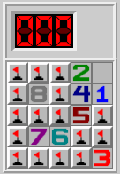

Minesweeper
===========

A [post on the puzzling stackexchange](https://puzzling.stackexchange.com/questions/89158/all-numbers-in-a-5x5-minesweeper-grid) a few years ago
asked for a placement of mines on a 5-by-5 minesweeper board such that each number from 0 to 8 appears exactly once. Here's one solution:



A 5-by-5 grid is actually the smallest grid where 0-8 can appear exactly once. Dmitry Kamenetsky studied the numbers _a(n)_ of the smallest grid
size that allows 0-8 to appear exactly _n_ times, and registered [the results](https://oeis.org/A302980/a302980.txt) as [sequence A302980](https://oeis.org/A302980)
in the Online Encyclopedia of Integer Sequences.

The script in this subdirectory generates Kamenetsky's _a(n)_ sequence.

To generate _a(n)_, first choose an n (say, 1) and run the script for a guess for _a(n)_ (here we'll guess 5, which happens to be correct):

```
$ poetry run python3 examples/minesweeper/minesweeper.py 1 5 /tmp/cnf /tmp/extractor.py
```

Next, solve the generated CNF file:

```
$ kissat /tmp/cnf > /tmp/solver-output
```

Finally, extract the solution:

```
$ python3 /tmp/extractor.py /tmp/cnf /tmp/solver-output
02xxx
14x8x
x5xxx
x6x7x
xx3xx
```

If you get a solution, like we did above, you've proven that _a(n)_ &le; _d_ for some _d_ (here, we showed _a(1)_ &le; _5_).
To prove equality, you need to find a _d_ such that running the script above with _d_ is satisfiable (shows a solution board)
and running the script above with _d-1_ prints UNSATISFIABLE.