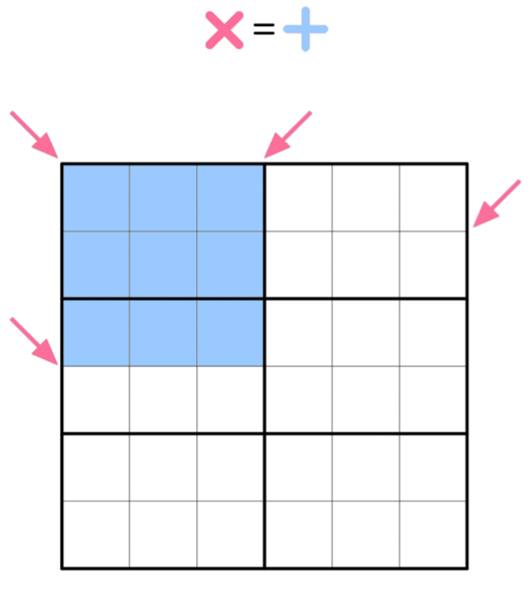
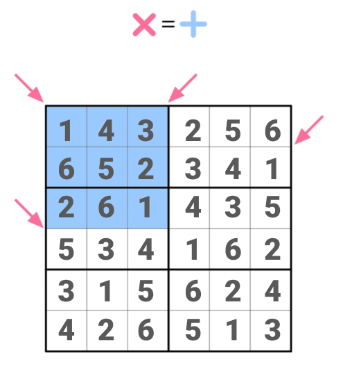

Product-Sum Sudoku
==================

This problem, originally from the [Royal Statistical Society Christmas Quiz 2023](https://rss.org.uk/RSS/media/File-library/Quiz/RSS-Christmas-Quiz-2023-R2.pdf),
was [re-posted on the puzzling stack exchange](https://puzzling.stackexchange.com/q/125989/84078):



(Normal Sudoku rules for this grid size apply. The product of the numbers
on each pink diagonal equals the sum of the numbers in the blue square.)

To solve it, generate the CNF file and extractor:

```
$ uv run python examples/product-sum-sudoku/product-sum-sudoku.py /tmp/out.cnf /tmp/extractor.py
```

Solve the CNF file:

```
$ kissat /tmp/out.cnf > /tmp/kissat.out
```

And extract the solution:

```
$ python3 /tmp/extractor.py /tmp/out.cnf /tmp/kissat.out
 1  4  3  2  5  6
 6  5  2  3  4  1
 2  6  1  4  3  5
 5  3  4  1  6  2
 3  1  5  6  2  4
 4  2  6  5  1  3
```

Or, drawn on the original board:

